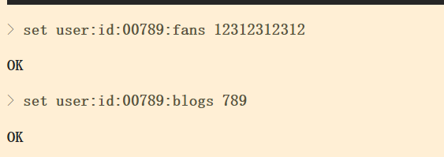
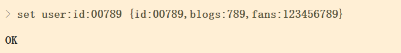
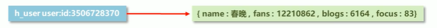
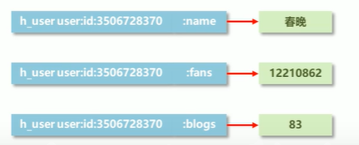
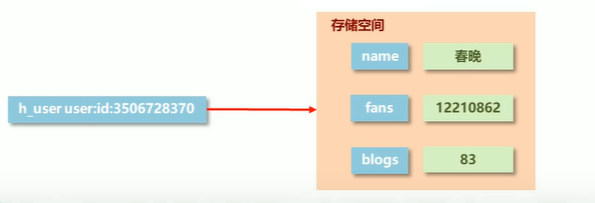
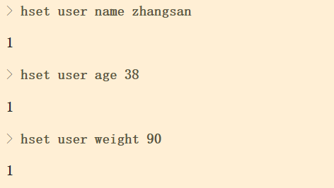
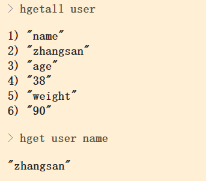

# String类型

## String类型数据的基本操作

- 添加/修改多个数据

  ```
  mset key1 value1 key2 value2...
  ```

- 获取多个数据

  ```
  mget key1 key2...
  ```

- 获取数据字符个数

  ```
  strlen key
  ```

- 追加信息到原始信息后部(如果原始信息存在就追加，否则新建)

  ```
  append key value
  ```

## String类型数据的扩展操作

### 数值增减操作

**大型企业级应用中，分库分表是基本操作，使用多张表存储同类型数据，但是对应的主键id必须保证统一性，不能重复。Oracle数据库具有sequence设定，可以解决该问题，但是Mysql数据库并不具有类似的机制，那么如何解决？**

> 解决方案

- 设置数值数据增加指定范围的值

  ```
  incr key
  incrby key increment
  incrbyfloat key increment
  ```

- 设置数值数据减少指定范围的值

  ```
  decr key
  decrby key increment
  ```

  

**String作为数值操作**

- String在redis内部存储默认就是一个字符串，当遇到增减类incr，decr是会转成数值型进行计算。
- redis所有的操作都是原子性的，采用单线程处理所有业务，命令是一个个执行的，因此无需考虑并发带来的数据影响。
- 注意：*按数值进行操作的数据，如果原始数据不能转成数值，或超越了redis数值上限范围，将报错。*

### 数据时效性设置

**业务场景**

新闻网站会出现热点新闻，热点新闻最大的特征是时效性，如何自动控制热点新闻的时效性。

> 解决方案

- 设置数据具有指定的生命周期

  ```
  setex key seconds value 
  psetex key milliseconds value
  ```

- redis 控制数据的生命周期，通过数据是否失效控制业务行为，适用于所有具有时效性限定控制的操作

## String类型数据操作的注意事项

1.**数据操作不成功的反馈与数据正常操作之间的差异**

​	①表示运行结果是否成功

​		(integer) 0 -> false 失败
​		(integer) 1 -> true 成功

​	②表示运行结果值

​		(integer) 3 -> 3 3个
​		(integer) 1 -> 1 1个

2.数据未获取到

​	（nil）等同于null

3.数据最大储存量

​	512MB

4.数值计算最大范围(Java中的Long最大值)
	9223372036854775807

## String类型应用场景

**业务场景**
主页高频访问信息显示控制，列如新浪微博大V主页显示粉丝数于微博数量

> 解决方案

- 在redis中为大V用户设定用户信息，以用户主键和属性值作为key，后台设定定时刷新策略即可

  

- 在redis中以json格式存储大V用户信息，定时刷新(也可以使用hash类型)



- redis应用各种结构型和非结构型高热度数据访问加速

## Key的设置约定

> 数据库中的热点数据key命名惯例

| 表名  | 主键名 | 主键值   | 字段名 |
| ----- | ------ | -------- | ------ |
| order | id     | 23424    | name   |
| news  | id     | 32432432 | title  |

# hash类型

## hash类型数据的基本操作

**存储的困惑**

​	对象类数据的存储如果具有较频繁的更新需求操作会显得笨重

​	1、json存储，获取不方便



​	2、string存储，是三条数据



​	3、hash存储

​		新的存储需求：对一系列存储的数据进行编组，方便管理，典型应用存储对象信息

​		需要的存储结构：一个存储空间保存多个键值对数据

​		hash类型：底层使用哈希表结构实现数据存储

​	


> ​	hash存储结构优化

​	**如果field数量较少，存储结构优化为类数组结构**

​	**如果field数量较多，存储结构使用hashmap结构**

- 添加/修改数据

  ```
  hset key field value
  ```

  

- 获取数据

  ```
  hget key field
  hgetall key
  ```

  

- 删除数据

  ```
  hdel key field1 [field2]
  ```

- 添加/修改多个数据

  ```
  hmset key field1 value1 field2 value2
  ```

- 获取多个数据

  ```
  hmget key field1 field2...
  ```

- 获取哈希表中字段的数量

  ```
  hlen key
  ```

- 获取哈希表中是否存在指定的字段

  ```
  hexists key field
  ```

  