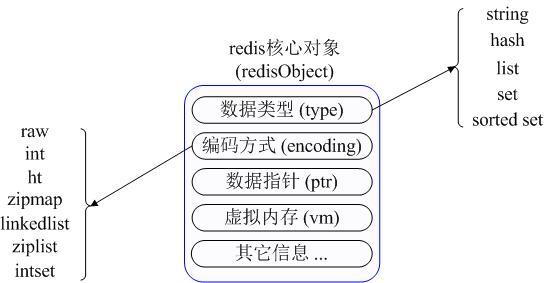
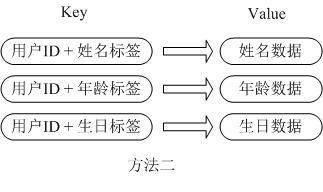

## Redis常用数据类型

- String
- Hash
- List
- Set
- Sorted set
- pub/sub
- Transactions

**在具体描述这几种数据类型之前，我们先通过一张图了解下Redis内部内存管理中是如何描述这些不同数据类型的：**

**首先Redis内部使用一个redisObject对象来表示所有的key和value,redisObject最主要的信息如上图所示：**

**type代表一个value对象具体是何种数据类型，encoding是不同数据类型在redis内部的存储方式。**

**比如：type=string代表value存储的是一个普通字符串，那么对应的encoding可以是raw或者是int,如果是int则代表实际redis内部是按数值型类存储和表示这个字符串的，当然前提是这个字符串本身可以用数值表示，比如:"123" "456"这样的字符串。**

**这里需要特殊说明一下vm字段，只有打开了Redis的虚拟内存功能，此字段才会真正的分配内存，该功能默认是关闭状态的，该功能会在后面具体描述。通过上图我们可以发现Redis使用redisObject来表示所有的key/value数据是比较浪费内存的，当然这些内存管理成本的付出主要也是为了给Redis不同数据类型提供一个统一的管理接口，实际作者也提供了多种方法帮助我们尽量节省内存使用，我们随后会具体讨论**

- String：

> Strings 数据结构是简单的key-value类型，value其实不仅是String，也可以是数字.
>
> 常用命令:  set,get,decr,incr,mget 等。
>
>  
>
> 应用场景：String是最常用的一种数据类型，普通的key/ value 存储都可以归为此类.即可以完全实现目前 Memcached 的功能，并且效率更高。还可以享受Redis的定时持久化，操作日志及 Replication等功能。除了提供与 Memcached 一样的get、set、incr、decr 等操作外，Redis还提供了下面一些操作：
>
> - 获取字符串长度
> - 往字符串append内容
> - 设置和获取字符串的某一段内容
> - 设置及获取字符串的某一位（bit）
> - 批量设置一系列字符串的内容

> **实现方式：**String在redis内部存储默认就是一个字符串，被redisObject所引用，当遇到incr,decr等操作时会转成数值型进行计算，此时redisObject的encoding字段为int。

- Hash

> **常用命令：**hget,hset,hgetall 等。
>
> **应用场景：**在Memcached中，我们经常将一些结构化的信息打包成HashMap，在客户端序列化后存储为一个字符串的值，比如用户的昵称、年龄、性别、积分等，这时候在需要修改其中某一项时，通常需要将所有值取出反序列化后，修改某一项的值，再序列化存储回去。**这样不仅增大了开销，也不适用于一些可能并发操作的场合**（比如两个并发的操作都需要修改积分）。而Redis的Hash结构可以使你像在数据库中Update一个属性一样只修改某一项属性值。
>
> ​    我们简单举个实例来描述下Hash的应用场景，比如我们要存储一个用户信息对象数据，包含以下信息：
>
> 用户ID为查找的key，存储的value用户对象包含姓名，年龄，生日等信息，如果用普通的key/value结构来存储，主要有以下2种存储方式：
>
>  
>
> 
>
> 第一种方式将用户ID作为查找key,把其他信息封装成一个对象以序列化的方式存储，这种方式的缺点是，增加了序列化/反序列化的开销，并且在需要修改其中一项信息时，需要把整个对象取回，并且修改操作需要对并发进行保护，引入CAS等复杂问题。
>
> 
>
> 第二种方法是这个用户信息对象有多少成员就存成多少个key-value对儿，用用户ID+对应属性的名称作为唯一标识来取得对应属性的值，虽然省去了序列化开销和并发问题，但是用户ID为重复存储，如果存在大量这样的数据，内存浪费还是非常可观的。
>
> 那么Redis提供的Hash很好的解决了这个问题，Redis的Hash实际是内部存储的Value为一个HashMap，并提供了直接存取这个Map成员的接口，如下图：
>
> 
>
> 也就是说，Key仍然是用户ID, value是一个Map，这个Map的key是成员的属性名，value是属性值，这样对数据的修改和存取都可以直接通过其内部Map的Key(Redis里称内部Map的key为field), 也就是通过 key(用户ID) + field(属性标签) 就可以操作对应属性数据了，既不需要重复存储数据，也不会带来序列化和并发修改控制的问题。很好的解决了问题。
>
> 这里同时需要注意，Redis提供了接口(hgetall)可以直接取到全部的属性数据,但是如果内部Map的成员很多，那么涉及到遍历整个内部Map的操作，由于Redis单线程模型的缘故，这个遍历操作可能会比较耗时，而另其它客户端的请求完全不响应，这点需要格外注意。
>
> **实现方式：**
>
> 上面已经说到Redis Hash对应Value内部实际就是一个HashMap，实际这里会有2种不同实现，这个Hash的成员比较少时Redis为了节省内存会采用类似一维数组的方式来紧凑存储，而不会采用真正的HashMap结构，对应的value redisObject的encoding为zipmap,当成员数量增大时会自动转成真正的HashMap,此时encoding为ht。

- List

> **常用命令：**lpush,rpush,lpop,rpop,lrange等。
>
> **应用场景：**
>
> Redis list的应用场景非常多，也是Redis最重要的数据结构之一，比如twitter的关注列表，粉丝列表等都可以用Redis的list结构来实现。
>
> Lists 就是链表，相信略有数据结构知识的人都应该能理解其结构。使用Lists结构，我们可以轻松地实现最新消息排行等功能。Lists的另一个应用就是消息队列，
> 可以利用Lists的PUSH操作，将任务存在Lists中，然后工作线程再用POP操作将任务取出进行执行。Redis还提供了操作Lists中某一段的api，你可以直接查询，删除Lists中某一段的元素。
>
> **实现方式：**
>
> Redis list的实现为一个双向链表，即可以支持反向查找和遍历，更方便操作，不过带来了部分额外的内存开销，Redis内部的很多实现，包括发送缓冲队列等也都是用的这个数据结构。

- Set

> **常用命令：**
>
> sadd,spop,smembers,sunion 等。
>
> **应用场景：**
>
> Redis set对外提供的功能与list类似是一个列表的功能，特殊之处在于set是可以自动排重的，当你需要存储一个列表数据，又不希望出现重复数据时，set是一个很好的选择，并且set提供了判断某个成员是否在一个set集合内的重要接口，这个也是list所不能提供的。
>
> Sets 集合的概念就是一堆不重复值的组合。利用Redis提供的Sets数据结构，可以存储一些集合性的数据，比如在微博应用中，可以将一个用户所有的关注人存在一个集合中，将其所有粉丝存在一个集合。Redis还为集合提供了求交集、并集、差集等操作，可以非常方便的实现如共同关注、共同喜好、二度好友等功能，对上面的所有集合操作，你还可以使用不同的命令选择将结果返回给客户端还是存集到一个新的集合中。
>
> **实现方式：**
>
> set 的内部实现是一个 value永远为null的HashMap，实际就是通过计算hash的方式来快速排重的，这也是set能提供判断一个成员是否在集合内的原因。

- Sorted Set

> **常用命令：**
>
> zadd,zrange,zrem,zcard等
>
> **使用场景：**
>
> Redis sorted set的使用场景与set类似，区别是set不是自动有序的，而sorted set可以通过用户额外提供一个优先级(score)的参数来为成员排序，并且是插入有序的，即自动排序。当你需要一个有序的并且不重复的集合列表，那么可以选择sorted set数据结构，比如twitter 的public timeline可以以发表时间作为score来存储，这样获取时就是自动按时间排好序的。
>
> 另外还可以用Sorted Sets来做带权重的队列，比如普通消息的score为1，重要消息的score为2，然后工作线程可以选择按score的倒序来获取工作任务。让重要的任务优先执行。
>
> **实现方式：**
>
> Redis sorted set的内部使用HashMap和跳跃表(SkipList)来保证数据的存储和有序，HashMap里放的是成员到score的映射，而跳跃表里存放的是所有的成员，排序依据是HashMap里存的score,使用跳跃表的结构可以获得比较高的查找效率，并且在实现上比较简单。

- Pub/Sub

> Pub/Sub 从字面上理解就是发布（Publish）与订阅（Subscribe），在Redis中，你可以设定对某一个key值进行消息发布及消息订阅，当一个key值上进行了消息发布后，所有订阅它的客户端都会收到相应的消息。这一功能最明显的用法就是用作实时消息系统，比如普通的即时聊天，群聊等功能。

- Transactions

> 谁说NoSQL都不支持事务，虽然Redis的Transactions提供的并不是严格的ACID的事务（比如一串用EXEC提交执行的命令，在执行中服务器宕机，那么会有一部分命令执行了，剩下的没执行），但是这个Transactions还是提供了基本的命令打包执行的功能（在服务器不出问题的情况下，可以保证一连串的命令是顺序在一起执行的，中间有会有其它客户端命令插进来执行）。Redis还提供了一个Watch功能，你可以对一个key进行Watch，然后再执行Transactions，在这过程中，如果这个Watched的值进行了修改，那么这个Transactions会发现并拒绝执行。

## Redis实际应用场景

 Redis在很多方面与其他数据库解决方案不同：它使用内存提供主存储支持，而仅使用硬盘做持久性的存储；它的数据模型非常独特，用的是单线程。另一个大区别在于，你可以在开发环境中使用Redis的功能，但却不需要转到Redis。

转向Redis当然也是可取的，许多开发者从一开始就把Redis作为首选数据库；但设想如果你的开发环境已经搭建好，应用已经在上面运行了，那么更换数据库框架显然不那么容易。另外在一些需要大容量数据集的应用，Redis也并不适合，因为它的数据集不会超过系统可用的内存。所以如果你有大数据应用，而且主要是读取访问模式，那么Redis并不是正确的选择。

​    然而我喜欢Redis的一点就是你可以把它融入到你的系统中来，这就能够解决很多问题，比如那些你现有的数据库处理起来感到缓慢的任务。这些你就可以通过Redis来进行优化，或者为应用创建些新的功能。在本文中，我就想探讨一些怎样将Redis加入到现有的环境中，并利用它的原语命令等功能来解决 传统环境中碰到的一些常见问题。在这些例子中，Redis都不是作为首选数据库。

## Demo

**显示最新的项目列表**

下面这个语句常用来显示最新项目，随着数据多了，查询毫无疑问会越来越慢。

**SELECT * FROM foo WHERE ... ORDER BY time DESC LIMIT 10**

> 在Web应用中，“列出最新的回复”之类的查询非常普遍，这通常会带来可扩展性问题。这令人沮丧，因为项目本来就是按这个顺序被创建的，但要输出这个顺序却不得不进行排序操作。
>
> 类似的问题就可以用Redis来解决。比如说，我们的一个Web应用想要列出用户贴出的最新20条评论。在最新的评论边上我们有一个“显示全部”的链接，点击后就可以获得更多的评论。
>
> 我们假设数据库中的每条评论都有一个唯一的递增的ID字段。
>
> 我们可以使用分页来制作主页和评论页，使用Redis的模板，每次新评论发表时，我们会将它的ID添加到一个Redis列表